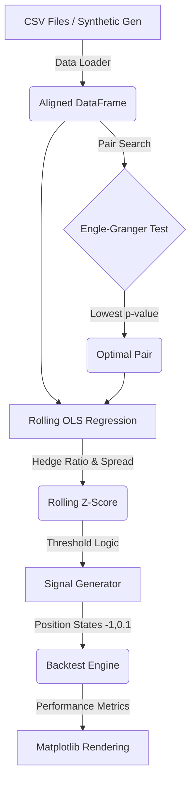

# System Architecture

## High-Level Architecture
The architecture is structured as a monolithic procedural pipeline. It operates as a single-pass script that processes historical data in batch mode. The modularity is separated by quantitative function (Data, Statistics, Signal, Simulation), but the state flows linearly from start to finish.

## Data Flow Diagram

## Module Breakdown

### 1. `main.py` (Controller)
The orchestrator. It sequentially invokes the data loader, feeds the dataframe to the cointegration scanner, passes the best pair to the signal generator, runs the backtest, and triggers the visualization generation. 

### 2. `data_loader.py` (Ingestion)
Handles file I/O operations using `pandas` and `glob`. It attempts to read standard Binance-style 1m CSV dumps. It aligns multiple asynchronous series onto a uniform `DatetimeIndex`. Critically, it contains a fallback mechanism to dynamically synthesize cointegrated time series if local files are absent.

### 3. `cointegration.py` (Econometrics)
The statistical engine. Contains a nested loop iterating over $O(N^2)$ asset combinations. Uses `statsmodels.tsa.stattools.coint` to estimate the cointegrating vector and test the residuals for stationarity.

### 4. `signals.py` (Alpha Generation)
Responsible for state tracking and signal creation.
- Uses `statsmodels.regression.rolling.RollingOLS` to dynamically adjust the beta coefficient.
- Calculates the spread mathematically as $Spread = Asset_Y - \beta \times Asset_X$.
- Normalizes the spread using a rolling mean and rolling standard deviation.
- Maps the continuous Z-score to discrete positional signals via a state-machine implemented as a standard Python `for` loop.

### 5. `backtester.py` (Simulation)
Evaluates the trading logic. Takes the time-series of position states and the raw asset returns, attempting to compute the portfolio-level PnL. Incorporates basic transaction costs and calculates standard financial metrics (Sharpe, Drawdown, Annualized Return).
